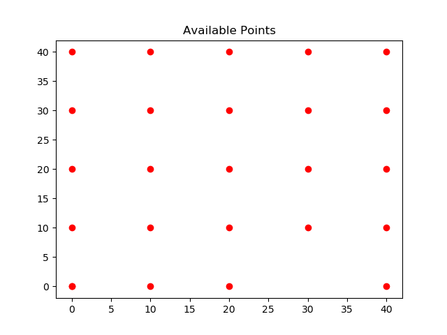
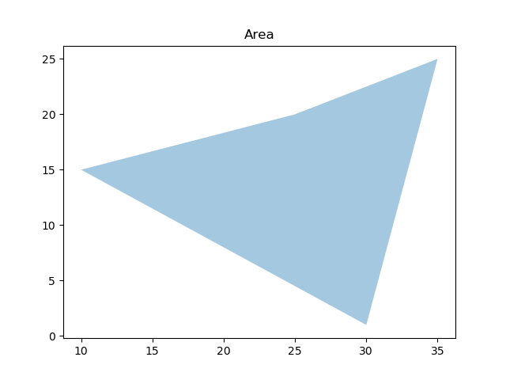
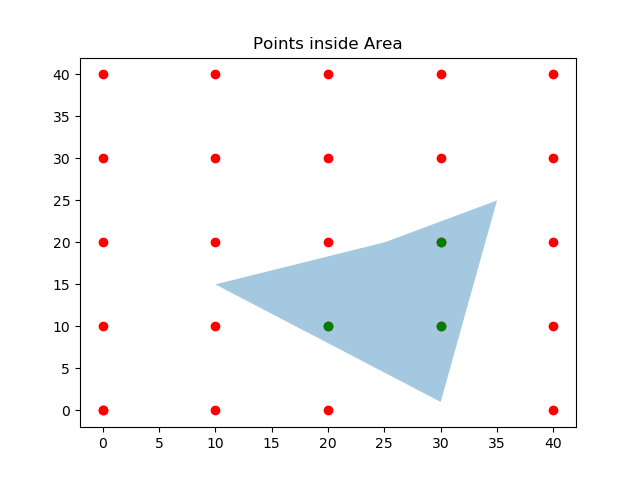

Locating points inside area or polygon
========================================
Supose we have a datapoint set:

And we have an available area or polygon (We need three points at least to create a polygon):

We want to know which points are inside the polygon (the colored area):

So, we can create a new dataset with those points that are located inside the polygon. Let's see how to obtain that with the next example:

Code Example
-----------------------
Firts let's import geo_loc and data, build the polygon and find the points inside it:

    code::

    >>from geo_loc.geo_loc import*
    >>a='points.txt'
    >>b='area.txt'
    >>area_coord, points, points_coord=read_data(a,b)
    >>p=poly_creation(area_coord)
    >>position=find_points(area_coord, points) #this finds points inside polygon or area
    >>df_points=save_position(position, points_coord)

Now let's plot the final result:
    code::
    
    >>fig, ax = plt.subplots()
    >>ax.add_collection(p) #this plot the polygon
    >>ax.scatter(points_coord['X'], points_coord['Y'], color='r')
    >>ax.scatter(df_points['X'], df_points['Y'], color='g') #this plot the points inside polygon
    >>ax.set_title('Points inside Area')
    >>ax.autoscale_view() 
    >>plt.show()

And the final result is:

