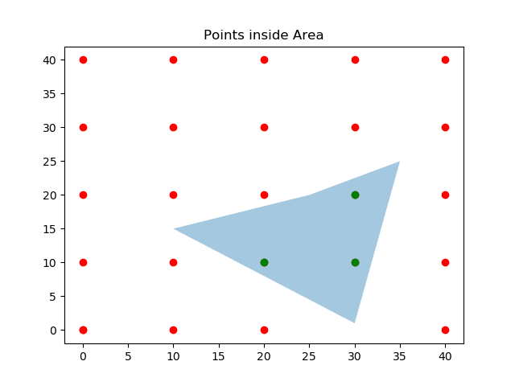

.. geo_loc documentation master file, created by
   sphinx-quickstart on Mon Aug 10 19:22:16 2020.
   You can adapt this file completely to your liking, but it should at least
   contain the root `toctree` directive.

Welcome to geo_loc's Documentation!
===================================

geo_loc  is a handy GIS tool for finding points within an area. geo_loc use Matplotlib library to create polygon from a list of (x,y) pairs, and to determine if a point is inside a given polygon or not. geo_loc simplifies this process.

So if we have X and Y points coordinates of outer limits of an area, with geo_loc a polygon can be created, and then we can see if another given point is located inside the polygon.

.. toctree::
   :maxdepth: 2
   :caption: Contents:

   example
   geo_loc

Download geo_loc on `GitHub <https://github.com/Bluejhonny/geo_loc>`_

Requirements
------------------------------

    * Python 3.7
    * Pandas
    * Numpy
    * Matploplib

Indices and tables
------------------------------

* :ref:`genindex`
* :ref:`modindex`
* :ref:`search`
